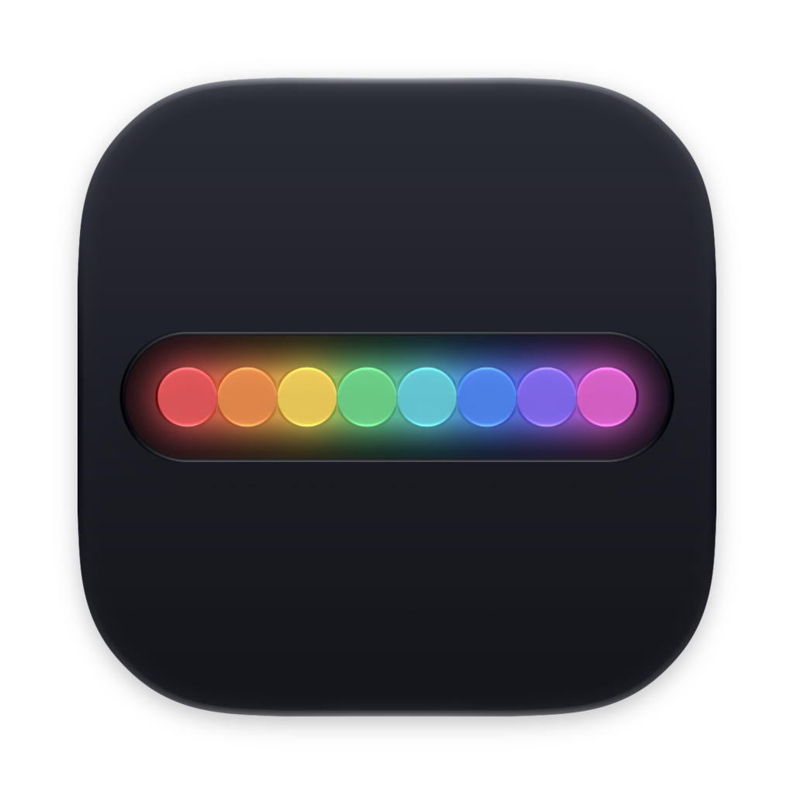
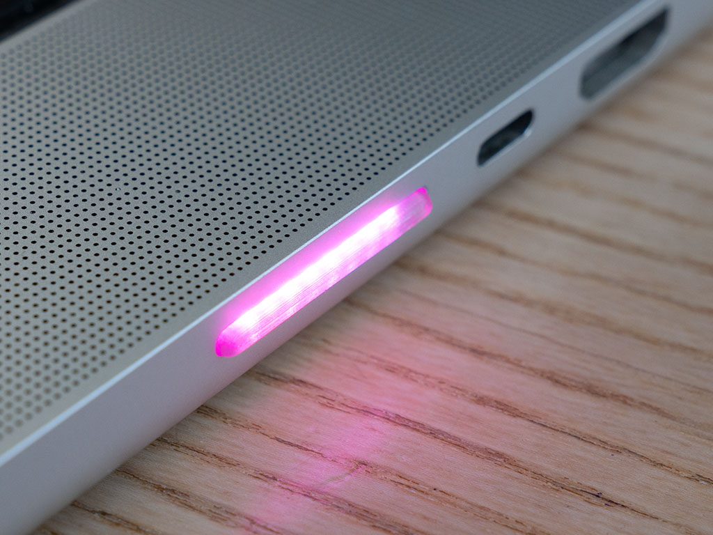
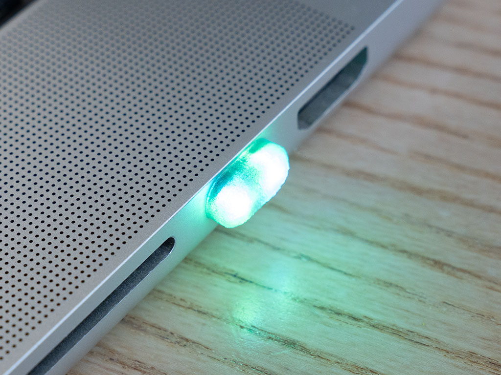
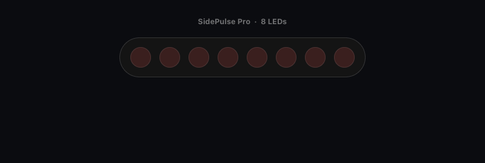

<p align="center">
  
</p>

<h1 align="center">MySidepulse</h1>

<p align="center">
  <strong>Know what Claude is doing without looking at the screen.</strong><br>
  An opinionated macOS menu-bar app for the <a href="https://sidepulse.io">SidePulse</a> LED strip: a red wave while
  Claude Code works, a green breath when it has finished, an amber blink when it needs you. It tells the truth
  about every session and every terminal on the Mac at once, and tells your phone when you have walked away.
</p>

<p align="center">
  
  
  
  
  
  
</p>

## The hardware

|  |  |
|:---:|:---:|
| **SidePulse Pro**: eight RGB LEDs, in the MacBook Pro's SD card slot | **SidePulse Dot**: two LEDs on USB-C, for every Mac |

SidePulse is a string of RGB LEDs that lives in a port of your Mac and is controlled by writing a file. It is
made by InteliWEAR and its author, [Peter Kuhar](https://x.com/pkuhar). **MySidepulse is an independent app for
it, not affiliated with its maker**, and everything about the hardware itself is at the source:

- **[sidepulse.io](https://sidepulse.io)**: the product, the two models, and where to order one
- **[github.com/inteliwear/sidepulse](https://github.com/inteliwear/sidepulse)**: the official companion app and
  command line, and the [LED program format](https://github.com/inteliwear/sidepulse/blob/main/LEDS_FORMAT.md)
- **[x.com/pkuhar](https://x.com/pkuhar)** and **[x.com/sidepulse](https://x.com/sidepulse)**: the maker and the
  product, with the news and the demos

<sub>Photographs © Peter Kuhar, from the official repository, MIT licence. See <a href="docs/assets/CREDITS.md">CREDITS</a>.</sub>

## The problem

You give Claude Code something long to do and turn to something else. Twenty minutes later you remember to
look: it finished eighteen minutes ago. Or worse, it stopped after two to ask whether it may run a command, and
has been waiting for you ever since.

With three sessions open it gets harder. One is working, one has finished, one is asking a question, and no
single light can say all of that unless somebody has decided what matters most and what may be shown side by
side. That decision is what this app is.

## Three states, at a glance

<p align="center">
  
</p>

<p align="center"><sub>An illustration of the strip, playing the real programs at their real rhythm.</sub></p>

| The strip | Means | Until |
|---|---|---|
| A **wave** rolling along it, each agent in its own colour | an agent is working | the turn ends |
| A **green breath**, every 4.5 s | an agent has finished | you have seen it, or 20 minutes |
| An **amber double blink** | an agent needs you: a question, a permission, a plan to approve, a turn that failed | you have seen it |
| Dark | nothing is going on | |

That is the whole point of the app, and everything else in it is built around never getting those three wrong.
A turn that ends in prose is *finished*, questions included: "Want me to commit?" is green. Amber is raised only
by an agent's explicit signals, so it always means a dialog is really standing there.

## It tells the truth about the whole Mac

This is what MySidepulse was written for.

- **Every session keeps its own state.** Each Claude Code session is followed on its own, so an event from one
  session can never overwrite what another is doing. Close one and the others carry on.
- **An alert and running work share the strip.** When one session needs you while another is still working,
  the amber takes the three LEDs on the left and keeps blinking, and the red wave keeps rolling on the rest. A
  finished session takes two steady green LEDs the same way. You see that there is something to look at *and*
  that the machine is still busy.
- **What needs you most wins.** A session waiting for you outranks a failed command, which outranks a finish,
  which outranks a command that succeeded. `mysidepulse status` lists every session one by one.
- **A finish is not announced while work is still out.** If the turn stops with subagents or background shells
  still running, the strip stays on the red wave and turns green 90 seconds after the last one has cleared.
- **Nothing flickers.** An alert has to stand for a second before it reaches the strip, so a dialog answered
  at once is never shown at all. Going to *working* has no such wait.

### Hooks are not the whole truth, so it does not stop at hooks

Claude Code's hooks are where the states come from, and on their own they lie by omission: ⎋ Escape and ⌃C end
a turn without firing anything, a `Stop` can be lost, a dialog can be answered with no event at all. A light
that is wrong once is a light you stop trusting, so MySidepulse also reads, without ever writing, Claude
Code's own record of its sessions and the end of the transcript:

| What happened | What the strip does |
|---|---|
| You interrupted the turn with ⎋ Escape or ⌃C | goes dark within about half a minute, with no false green |
| The `Stop` event never arrived, and the transcript shows a completed answer | turns green, and your phone is told |
| You answered a dialog and no hook said so | goes back to the red wave within about 15 seconds |
| Claude Code quit or crashed | that session is forgotten at once |

## An alert stays until you have seen it

A needs-you alert stays for as long as its dialog does, a finish for twenty minutes, and neither nags once you
have looked.

- **Seeing it means going to it.** An alert is acknowledged when the app hosting that session comes to the
  front and you touch the keyboard or the mouse there. In Terminal and iTerm2 it goes down to the **tab**:
  looking at another tab of the same window clears nothing.
- **Acknowledging clears the strip and cancels the phone notification** that was about to leave.
- **It is remembered.** The acknowledgement is written down, so restarting the app does not bring an old alert
  back. A new alert on the same session starts unacknowledged again.
- **When in doubt, it clears.** An unknown terminal, a denied permission or a session with no window of its own
  widen what counts as seen. Nothing can strand an alert on the strip.

## When you are away, your phone knows

The same *finished* and *needs you* alerts go to your phone through [ntfy](https://ntfy.sh), a free and open
notification service with apps for iOS and Android.

- **Only when you are not there.** A notification is prepared 15 seconds after the alert. If you have touched
  the Mac in the last minute and the screen is unlocked, it waits, and keeps waiting until you leave. Come back
  and look at the session first, and it is never sent.
- **Nothing private leaves the Mac.** A notification carries a fixed label (*Finished*, *Asking you something*,
  *Needs permission*, *Plan ready*, *Turn failed*) and a link that opens the session on claude.ai. Never a
  path, a repository name, a prompt or a line of the transcript.
- **Nothing arrives late.** A notification the Mac slept through is dropped, not delivered an hour afterwards.
- **Set up in a minute.** Turn it on in Settings › Notifications, scan the QR code with the ntfy app, press
  *Send a Test Notification*. The topic is a random secret, kept in a file only you can read, masked everywhere
  it is displayed, and replaced with one button.
- **Quiet sessions stay quiet.** Sessions that Claude Code runs in the background light the strip and never
  notify your phone.

## The terminal too

The strip is not only for Claude. Any long command can use it:

```sh
mysidepulse run -- make test            # one command
eval "$(mysidepulse shell-init zsh)"    # or every command, from ~/.zshrc (Settings › System sets it up for you)
```

A running command is a **violet wave**, a success a green breath, a failure the amber blink. Short commands
stay dark: with the zsh hook a command shows only after 5 seconds, and editors, pagers, `ssh`, `tmux` and the
like are skipped. ⌃C clears the job and does not fail it. `mysidepulse run` always exits with the
command's own status, and never fails a command because the app is down.

Claude outranks a command: a running job's colour is hidden while Claude works, but a job's *outcome* still
takes the left of the strip while Claude's wave keeps the rest.

## Drive it from the keyboard

Everything the menu does, the `mysidepulse` command line does, which makes it easy to bind to a key with
[skhd](https://github.com/asmvik/skhd) or any other launcher:

```sh
mysidepulse led auto|off|toggle            # toggle flips the strip between off and auto
mysidepulse led '#ff6a00'                  # any colour
mysidepulse led rainbow                    # an effect: rainbow aurora ocean lava ember sparkle
mysidepulse brightness cycle [--steps N]   # steps even to the eye, off after 100 %, then the first step again
mysidepulse status [--json]                # mode, strip, battery, every session and command
mysidepulse doctor                         # twelve health checks; the exit code is the number of failures
mysidepulse notify [on|off|test|topic new] # phone notifications
mysidepulse install-hooks | uninstall-hooks
mysidepulse autostart [on|off]             # open at login, and reopen after a crash
```

An example for `~/.skhdrc`, with the command line at its place inside the app:

```sh
hyper - l : /Applications/MySidepulse.app/Contents/MacOS/mysidepulse led toggle    # the strip, off and back
hyper - r : /Applications/MySidepulse.app/Contents/MacOS/mysidepulse led rainbow
hyper - 0 : /Applications/MySidepulse.app/Contents/MacOS/mysidepulse led auto
hyper - b : /Applications/MySidepulse.app/Contents/MacOS/mysidepulse brightness cycle --steps 3
```

A manual mode outranks everything: choose *off*, a colour or an effect and the strip holds it until you go
back to *auto*. Sessions are still followed and your phone is still told.

## It looks after the strip

- **Pull it out whenever you like.** The app carries on without it and repaints it the moment it comes back.
  Several strips can be plugged in at once; each shows the same state, drawn for its own number of LEDs.
- **It survives sleep.** macOS ejects a card in the built-in reader at the lock screen after a hibernate wake,
  and powers the reader down after a few idle minutes. MySidepulse refuses the first and prevents the second,
  so a SidePulse Pro is still lit in the morning. Quit the app to release the card.
- **Quitting turns it off.** A lit strip means something only while somebody is watching, so none is left
  behind.
- **The battery, when it matters.** Plug or unplug the power cord and the strip shows the charge as a bar for
  7 seconds. At 15 % on battery it breathes red until you do something about it.
- **Brightness per strip**, remembered by name, and a **Playground** that plays any state or effect on the real
  strip for 30 seconds, so you can learn what each one looks like before it matters.
- **Your own colours** for every state, picked on the Colours page while the strip plays the state you are
  recolouring.

## Settings

An eight-page window, opened from the menu-bar item (⌘,) or by opening the app again, which is the way in when
the icon is hidden. Every change applies as you make it.

| Page | What is on it |
|---|---|
| **General** | Open at login and reopen after a crash · Show in menu bar · Updates · Quit · Uninstall |
| **Strip** | the live strip and a sentence saying what it shows and why · Auto, Off, a colour or one of six effects · brightness for each strip |
| **Colours** | the colour of each state and each battery band, with a live preview on screen and on the strip · reset one or all |
| **Notifications** | the phone switch · the ntfy server · the topic, with its QR code · a test button |
| **Playground** | thirteen states and six effects to try on the real strip |
| **System** | set up or remove each agent's hooks (Claude Code, Codex, GitHub Copilot CLI, OpenCode's plugin) and the terminal hook, each with one button, Copilot's and OpenCode's groups shown only while that agent is on the Mac · allow notifications · show the welcome wizard again |
| **Health** | whether MySidepulse works, at a glance, in two tables. Health: each agent's hooks, the terminal hook, the notification permission, the strip, the launch agent, and while they apply the phone link, the command and a recent crash, each green, orange or red, then *Check Again*. Information: the last hook event, the agent sessions, the terminal commands, what the strip shows |
| **Tip** | everything is free and stays free · a one-time tip on Ko-fi |

The app speaks **English and French**, following the language your Mac is set to. The command line is always
in English.

## Install

Download the disk image from [the latest release](https://github.com/bambidotexe/my-sidepulse/releases/latest),
open it and drag **MySidepulse** to Applications, then open it once. It is signed with a Developer ID and
notarized by Apple, so it opens without a warning. That first launch registers it to open at login and to
restart after a crash, and hands the running copy to launchd. A short welcome wizard then walks you through
everything MySidepulse needs: the Claude Code hooks, the terminal hook, notifications on this Mac and alerts
on your phone. Set up the hooks there and MySidepulse starts following your sessions. Every permission it
ever asks for follows a click of yours, and nothing is asked before you press for it.

From this repository instead:

```sh
make install
```

That builds the same signed, notarized bundle, puts it in `/Applications`, launches it, sets up the hooks or
plugin of whichever of Claude Code, Codex, GitHub Copilot CLI and OpenCode is on the Mac, and prints
`mysidepulse doctor`. Claude Code's and Codex's hooks go into their own `settings.json` / `hooks.json`, backed
up first; entries that are not MySidepulse's are left alone. What "picking up the new hooks" means differs by
agent: Claude Code's open sessions pick them up within seconds; Codex's wait until the hooks have been trusted
in Codex; Copilot reads its hook file when a session starts; a running OpenCode server loads the plugin within
a second.
`make uninstall` reverses either one; your settings and the journal stay. Settings › General › Uninstall does
the same from inside the app.

The command line lives at `/Applications/MySidepulse.app/Contents/MacOS/mysidepulse`; symlink it onto your
`PATH` if you like.

MySidepulse keeps itself up to date. It looks for a newer version when it starts and once a week, and tells
you with a notification. Click **Update**, there or in Settings › General, and a small window fetches it;
**Install and Relaunch** then swaps the app and reopens it, and says so when it is back. Nothing is fetched or
installed without a click.

## Build from source

```sh
swift test          # the Core and Platform suites; read both summary lines
make app            # assembles build/MySidepulse.app
make install        # applies a change; then `mysidepulse doctor`
```

It is a SwiftPM package with no Xcode project and no third-party dependency. `make app` wants full Xcode for
the `actool` that compiles the app icon; with the Command Line Tools alone it still builds, warns, and ships
the flat icon without Liquid Glass. The icon's source is `Resources/AppIcon.icon`, an Icon Composer document;
`Resources/ICON-NOTES.md` describes its layers.

## Requirements

- **macOS 26 or later**, and a Swift toolchain to build it.
- **A SidePulse Pro or Dot.** The app runs without one: sessions are followed and your phone is still told.
- **Claude Code, Codex, GitHub Copilot CLI or OpenCode** — any subset. Claude Code's hooks are always
  installed; Codex, Copilot and OpenCode are each followed only while it is on the Mac. **zsh**, if you want
  terminal commands on the strip.
- **Two permissions**: removable volumes, because the strip mounts as one (macOS may ask once), and Automation
  for Terminal or iTerm2, asked the first time one of them comes to the front, so that looking at one tab
  clears only that tab's alert. Refuse the second and acknowledgement covers the whole terminal app. No
  Accessibility, Input Monitoring, Screen Recording or Full Disk Access.

## How it differs from the official app

The [official companion](https://github.com/inteliwear/sidepulse) does far more than this one: it follows
Codex, Claude, Grok, Cursor and Junie, links an iPhone, runs on Linux, ships a library of animations and a
virtual strip in the notch. If you use several agents, start there.

MySidepulse is one person's opinion of what the strip should say about **Claude Code, Codex, GitHub Copilot
CLI, OpenCode and the terminal**. It trades the official app's wider reach for depth on those:

| | Official app | MySidepulse |
|---|---|---|
| Agents | Codex, Claude, Grok, Cursor, Junie | Claude Code, Codex, GitHub Copilot CLI, OpenCode, and any terminal command |
| Several sessions | one state for the whole machine: the highest-priority one | each session keeps its own state; an alert and running work are shown side by side |
| Missed hooks | an optional transcript fallback | each agent's own side channel, always on: Claude Code's registry and transcript, Codex's rollout and daemon, Copilot's `events.jsonl`; OpenCode needs none, every turn ends in one terminal event |
| Seeing an alert | a finish stays lit for 20 minutes | an alert stays until you go to its session, down to the terminal tab, and that also cancels the phone notification |
| Away from the Mac | its own iPhone app | [ntfy](https://ntfy.sh), only when you are away, with nothing private in it |
| When idle | a very dim pulse | dark |
| Built with | Python | Swift, no dependency, one app and its command line |

<sub>The official column describes that project's README as of September 2026.</sub>

## How it works

Claude Code runs `mysidepulse hook` on fifteen of its events and Codex `mysidepulse hook --agent codex` on
twelve; GitHub Copilot CLI's own hook file and OpenCode's own plugin run the same binary for their events. Each
hook drops everything private (prompts, tool inputs, tool outputs), appends one short line to a journal and
exits; it never blocks a turn and never fails one. The app follows the journal, folds it into one state machine
per session, lets an arbiter pick a single display state from the sessions, the jobs, the battery and the mode,
and writes that state to the strip.

The strip is a closed device with no USB or serial channel: it mounts as a small volume, and the whole
protocol is a few lines of text written to a file called `LEDS.LED`. Every rule that can be decided from
values alone lives in `MySidepulseCore`, a Foundation-only library that never reads a clock, which is what lets
the tests, and a replay of the real journal, drive it. See `docs/architecture.md` and `docs/device.md`.

## Documentation

| | |
|---|---|
| [CLAUDE.md](CLAUDE.md) | The operating manual for working on it: what it is, who decides what, the change workflow, where each change lands, commands, rules. Start here. |
| [docs/README.md](docs/README.md) | The index of the documents below, and the sync rule. |
| [docs/functional.md](docs/functional.md) | What it does: every state, rule, delay, command and setting. Authoritative. |
| [docs/architecture.md](docs/architecture.md) | Targets, layers, threading, control socket, persistence, build. |
| [docs/device.md](docs/device.md) | The strip and the exact program text the host writes. |
| [docs/macOS.md](docs/macOS.md) | Card slot, sleep, permissions, launchd, signing. |
| [docs/pitfalls.md](docs/pitfalls.md) | Traps already fallen into, and open issues. |

## Support

MySidepulse is free and carries no ads. If it saves you trouble, you can leave a tip on
[Ko-fi](https://ko-fi.com/bambidotexe).

## Notes

- Personal build: English and French, no licensing.
- `swift test` runs 756 tests across the two library targets (565 + 191); the app target's verification is the
  strip itself, `mysidepulse doctor` and the journal replay.
- Every colour is a true colour, the same hex on the strip and on screen; a strip's brightness is what dims it.
  The defaults are the owner's, and the Colours page changes them.
- SidePulse is the hardware and MySidepulse is this app. The name, the hardware and its photographs belong to
  their maker.
